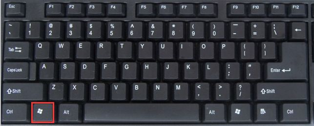
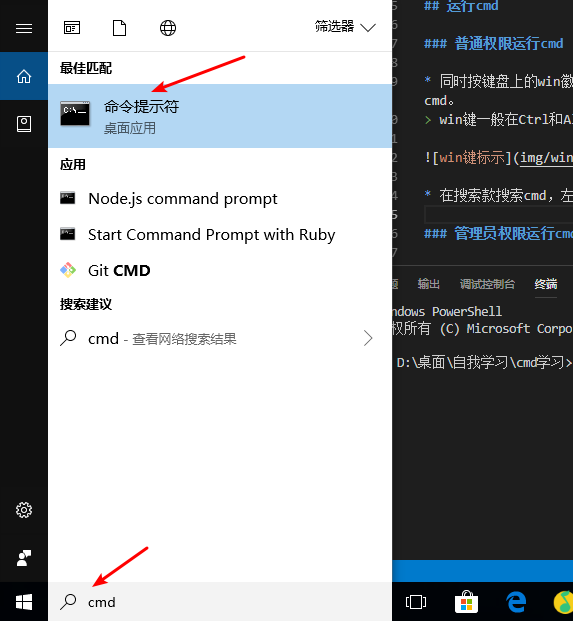
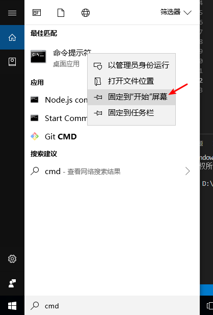
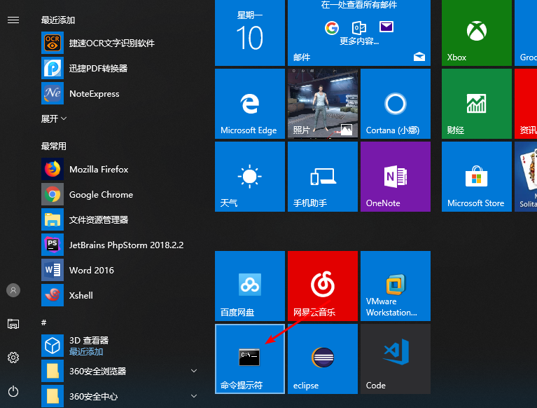

# cmd命令行

命令提示符与旧时的MS-DOS不同的是，它由一个名为CMD.exe的程序管理。CMD在Windows NT引入，并且CMD和PowerShell是所有Windows现代版本的命令SHELL。

## 运行cmd

### 普通权限运行cmd 

* 同时按键盘上的win徽标键+R键，出现运行窗口然后输入cmd。
> win键一般在Ctrl和Alt键之间。



* 在搜索栏搜索cmd，左键点击打开



### 管理员权限运行cmd

* 在搜索栏搜索cmd,右键以管理员身份运行

> 提示：搜索cmd，右键选择固定到开始屏幕，以后就能很容易找到cmd。




> 下面的批处理可以自动请求管理员权限而不需要右键管理员运行

```
@echo off

>nul 2>&1 "%SYSTEMROOT%\system32\icacls.exe" "%SYSTEMROOT%\system32\config\system"

if '%errorlevel%' NEQ '0' (

echo 请求管理员权限...

goto UACPrompt

) else ( goto gotAdmin )

:UACPrompt

echo Set UAC = CreateObject^("Shell.Application"^) > "%temp%\getadmin.vbs"

echo UAC.ShellExecute "%~s0", "", "", "runas", 1 >> "%temp%\getadmin.vbs"

"%temp%\getadmin.vbs"

exit /B

:gotAdmin
echo 目前已得到管理权限
pause
```
### cmd选项
cmd拥有几个命令行选项.尽管你不经常使用这些选项，但还是要熟悉它们。要用替代设置启动一个命行shell，可以带有额外的参数输入start cmd,或者从一个快捷方式、批处理文件等运行cmd。

```
cmd [/a | /u] [/q] [/d] [/f:on|off] [/c | /k]
```

* */a* 产生使用ANSI编码的标准输出
* */u* 产生使用Unicode编码的标准输出
* */q* 关闭回显
* */d* 关闭注册表中定义的AutoRun命令的执行。如果一个恶意程序（或你）设置了一个糟糕的AutoRun项的话，请使用这个选项
* */f* 打开或关闭文件和目录名自动完成功能
* */c* 执行command中的命令，然后停止
* *k* 执行command中的命令，然后进一步从标准输入读取命令，直到文件末尾或接收到exit命令

如果使用的话，/c和k选项必须直接出现在命令字符串的前面。/c和k之后的任何内容，作为要运行的命令的一部分对待，而不是作为CMD的一个参数对待。

## 命令行处理