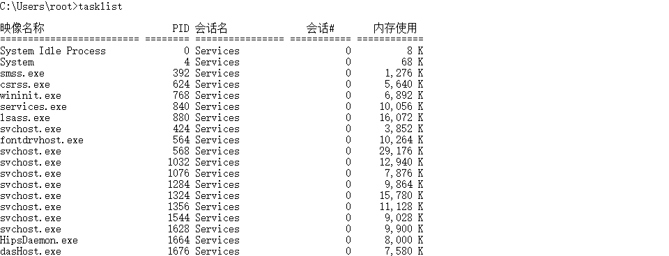
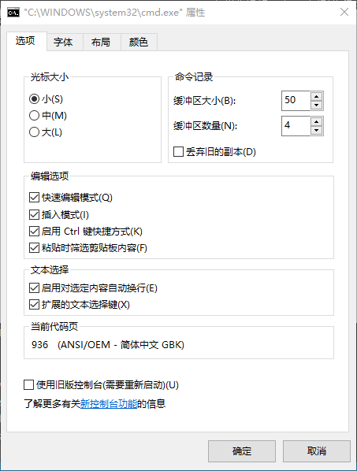
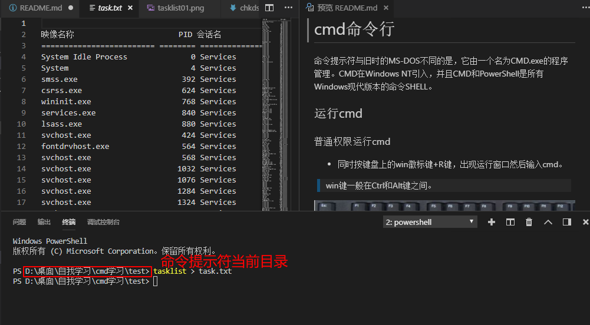

# 命令行学习笔记

## 目录

* [运行cmd](#运行cmd)
* [命令行处理](#命令行处理)
* [停止失控程序](#停止失控程序)
* [使用控制台窗口](#使用控制台窗口)
* [输入输出重定向](#输入输出重定向)
* [用set命令设置变量](#用set命令设置变量)
* [使用for命令扫描文件](#使用for命令扫描文件)

命令提示符与旧时的MS-DOS不同的是，它由一个名为CMD.exe的程序管理。CMD在Windows NT引入，并且CMD和PowerShell是所有Windows现代版本的命令SHELL。

## 运行cmd

### 普通权限运行cmd 

* 同时按键盘上的win徽标键+R键，出现运行窗口然后输入cmd。
> win键一般在Ctrl和Alt键之间。


* 在搜索栏搜索cmd，左键点击打开


### 管理员权限运行cmd

* 在搜索栏搜索cmd,右键以管理员身份运行

> 提示：搜索cmd，右键选择固定到开始屏幕，以后就能很容易找到cmd。


> 下面的批处理可以自动请求管理员权限而不需要右键管理员运行

```
@echo off

>nul 2>&1 "%SYSTEMROOT%\system32\icacls.exe" "%SYSTEMROOT%\system32\config\system"

if '%errorlevel%' NEQ '0' (

echo 请求管理员权限...

goto UACPrompt

) else ( goto gotAdmin )

:UACPrompt

echo Set UAC = CreateObject^("Shell.Application"^) > "%temp%\getadmin.vbs"

echo UAC.ShellExecute "%~s0", "", "", "runas", 1 >> "%temp%\getadmin.vbs"

"%temp%\getadmin.vbs"

exit /B

:gotAdmin
echo 目前已得到管理权限
pause
```

### cmd选项
cmd拥有几个命令行选项.尽管你不经常使用这些选项，但还是要熟悉它们。要用替代设置启动一个命行shell，可以带有额外的参数输入start cmd,或者从一个快捷方式、批处理文件等运行cmd。

```
cmd [/a | /u] [/q] [/d] [/f:on|off] [/c | /k]
```

* */a* 产生使用ANSI编码的标准输出
* */u* 产生使用Unicode编码的标准输出
* */q* 关闭回显
* */d* 关闭注册表中定义的AutoRun命令的执行。如果一个恶意程序（或你）设置了一个糟糕的AutoRun项的话，请使用这个选项
* */f* 打开或关闭文件和目录名自动完成功能
* */c* 执行command中的命令，然后停止
* *k* 执行command中的命令，然后进一步从标准输入读取命令，直到文件末尾或接收到exit命令

如果使用的话，/c和k选项必须直接出现在命令字符串的前面。/c和k之后的任何内容，作为要运行的命令的一部分对待，而不是作为CMD的一个参数对待。

[回到目录](#目录)

## 命令行处理
cmd最基本的工作是读取拥有如下形式的命令行:

`programname arguments`

给定这条命令，CMD会尝试找到一个名为programname的可执行程序文件。如果它确实找到这样的一个文件，它让Windows启动该程序。命令行上所输入的任何额外的文本（即命令行参数），都传递给该程字来解释。当然，实际上，事情没那么简单：

* CMD识别诸如set和cls的一些内建命令。对此，CMD不会搜索一个文件，而是处理命令自身。·如果该命令不是内建的，CMD首先在当前的工作目录中查找一个名为programname的文件，然后，在一个称为搜索路径的目录列表中查找它，你可以调整这个搜索路径。默认的搜索路径包括 \WINDOWS 下的几个子文件夹。

* 如果当你输入命令的时候，明确地添加了.EXE这样的一个文件名扩展，CMD只是在搜索路径中查找这类文件。如果你没有指定文件类型，CMD查找某个已知文件类型。文件类型的列表叫做 PATHEXT列表，并且，如果需要的话，你可以修改列出的文件类型及其优先级。

* 当CMD已经找到与你输入的命令的名称相匹配的一个文件，CMD查看该文件的扩展以确定对它做些什么。如果该文件的扩展名为.EXE或.COM，则它是一个可执行程序并且会直接运行。

* 扩展名为.BAT和.CMD的文件作为批处理文件对待，并且CMD自行解释它们。对于任何其他的文件类型，CMD使用来自Windows注册表的文件关联信息来确定做什么。如果文件类型与一个应用程序关联，CMD启动相关联的应用程序以打开该文件。例如，WSH用来运行扩展名为.VBS、.WSF和.JS的文件

* 很多字符，包括<>（）；，1^&%和！，对于CMD都有特殊的含义，并且会改变它对命令的解释。我们稍后介绍这一主题。

[回到目录](#目录)

## 停止失控程序

偶尔会有这种情况，你输入一条命令，一页又一页充满文字的内容涌向屏幕，一些不祥的警告，告诉你不能对Windows做出这样的修改，你想要赶快停止这些。

如果你按下Ctrl+C，大多数命令行程序会停止。如果这种方式无效，Ctrl+Break往往会有效 *（笔记本键盘上没有BREAK键）*。最后的一招，你可能通过点击命令提示符窗口右上角的关闭按钮来直接关闭它。

你还会发现tasklist和taskkill命令行程序很有用。

[回到目录](#目录)

## 控制台程序输入输出

和带有菜单和按钮的一个窗口面板的Windows程序不同，从一个命令提示符窗口运行的大多数程都直接将信息一行一行地输出到命令提示符窗口。这些程序叫做控制台程序，因为它们就像在计算机主终端上运行的旧式程序一样，通过纯文本输入和输出来交互；那时，主终端往往叫做控制台。

tasklist命令是控制台程序的一个典型例子。如果你在命令提示符窗口输入tasklist并按下回车键，这个程序会显示当前在你的计算机上运行的所有程序和服务的一个列表，如图所示。


[回到目录](#目录)

## 使用控制台窗口

通常，命令提示符程序在一个常规窗口中运行，该窗口有一个标题栏、调整大小按钮、一个关闭按钮和滚动条。

为了更便于查看，或者说让程序看上去更像是它在使用DOS运行，**你可以按下Alt+Enter，以全屏模式来运行程序**。
如果你运行一个DOS图形化程序，则自动转为全屏。在这个模式中，程序接管整个屏幕，并且所有其他的Windows功能都消失了。**你可以再次按下Alt+Enter返回到Windows桌面**。

你可以使用窗口的Properties（属性）对话框，来设置屏幕模式和窗口能够滚动的行数，如图10-2所示。你还可以设置窗口的颜色和字体。通常，你不需要调整字体。最好只是以常规的方式调整窗口的大小；窗口会相应地调整字符大小。


[回到目录](#目录)

## 输入输出重定向

通常，控制台程序的任何输出都出现在命令提示符窗口中，但是，你可以使用>符号将其重定向到一个文件中。例如，命令

```tasklist > task.txt```

产生与前面的示例相同的列表，但是，将其存储到一个名为tasks.txt的文件中。(**task.txt在命令提示符当前目录**)



命令行程序将其输出发送到所谓的标准输出流（standard output stream）。默认情况下，程序发送到标准输出的任何内容都会在命令提示符窗口中显示出来。

一些程序从一个标准输入流读取输入。默认情况下，这会连接到你的键盘，并且，你输入的所有内容由程序读取。例如，sort命令从标准输入读取文本行，将它们按照字母表顺序排序，并且将结果写到标准命出。如果你在命令提示符输入如下的行：

```
sort
c
b
a
Ctr1+Z
```

sort会按照下面的顺序输出这些行：a，b，c（注意，一行上的Ctrl+Z自身表示输入结束）。你可以使用 *<*
字符重定向标准输入。例如，命令

```
sort < somefile.txt
```

告诉sort从文件somefile.txt读取输入。你可以同时使用输入和输出重定向。命令

```
sort <somefile.txt >sortedfile.txt
```

将somefile.txt的内容重新排列，并创建一个名为sortedfile.txt的新文件。

也可以使用 *>>* 字符，从而指明输出不是替代一个已有的文件，而是应该直接附加到其末尾，如下面的示例所示：

```
dir /b c:\ >listing.txt
dir /b d:\ >>listing.txt
```

第一条命令创建了文件listing.txt，第二条命令将其输出附加到listing.txt的末尾（如果文件listing.txt还不存在的话，不要担心，>>会创建它）。

最后，可以使用竖线符号（|）（通常在键盘上位于反斜杠字符的上方），将一个程序的输出直接挂接到另一个程序的输入。例如，find命令从输入读取行，并且只是传递包含了一个指定字符串的行。命令

```
tasklist | find "cmd"
```

让tasklist将其所有程序的列表发送给ind，而 find挑选出包含“cmd”的一行或多行。最终，

```
tasklist | find "cmd" > task.txt
```

将tasklist连接到find，并把find连接到一个文件。输入和输出重定向允许你连接程序和文件，就好像你在做管道的连接一样。因此，|符号通常称为管道符号，并且，find这样的程序通常叫做过滤器。

> **注意:**我们所熟知的一个方便的过滤器是more，这个程序将给它的任何内容作为输入，传递给其输出。使得more有用的地方在于，在打印了一屏文本之后，它就暂停了。more允许你查看一个长长的列表，如果没有它的话，屏幕会快速卷起来而无法阅读。例如，命令：

```
tasklist I more
```

> 帮助你看到程序的整个列表。当你看到屏幕底部的提示-more--，按下空格，就可以查看下一屏完整内容。

标准错误是控制台程序可用的另一个输出流。默认情况下，如果一个程序向标准错误流写信息，命令提示符窗口中会出现文本。程序通常使用它来显示想让你看到的重要错误信息，即便标准输出重定向到一个文件或管道。如果你想要将错误消息捕获到一个文件中的话，你也可以重定向标准错误。

下表列出了CMD所识别的所有重定向指令。

**输入输出重定向**

| 重定向选项 | 操作 |
| --- | --- |
| <file | 从文件读标准输入 
| >file | 写标准输出到文件
| >>file | 附加标准输出到文件
| 1>file | 写标准输出到文件
| 1>>file | 附加标准输出到文件
| 2>file | 写标准错误到文件
| 2>>file | 附加标准错误到文件
| 2>&1 | 将标准错误定向到和标准输出相同的流。然后，都可以重定向到一个文件或管道连接到另一个程序
| \|  next-command | 发送输出作为nextcommand的输入
*注:数字1指的是标准输出流，数字2指的是标准错误输出流*

输出重定向的两种特殊形式，是输出到NUL设备和输出到打印机。Windows识别任何驱动器上的任何文件夹中的特殊文件nul，并且将其当做一个“黑洞”文件对待。如果你执行一条命令，并且将其输出重定向到nul，输出将会被丢弃。当你想要在批处理文件中做某些事情，但是不想要或不需要让用户看到它可能打印出的任何错误消息的时候，这类定向很有用。

例如，
```
net use f: /del >nul 2>nul
```
运行net use命令，并且确保不会让用户看到输出。

[回到目录](#目录)

## 用set命令设置变量

### 在批处理文件中执行数字计算

命令`set /A expression`会得到一个字符串作为一个数学表达式。表达式中的任何赋值语句，会导致CMD将结果格式化为一个字符串，并且将其赋值给一个指定的环境变量。表达式使用标准数学语法，表达式中允许的运算符按照优先级递减的顺序列出如下：

| 运算符 | 说明 |
| --- | --- |
| () | 组合表达式 |
| !~- | 一元运算符: 布尔NOT、位取反、算数取负 |
| */% | 乘法、除法、取余数 |
| + - | 相加、相减 |
| <<>> | 位左移  位右移 |
| & | 位AND |
| \|^ | 位OR或异OR |
| = *= /= %=等等  | 赋值 |
| , | 分开多个表达式 |


任何数字字母单词用来表示环境变量。在一个表达式中，如果一个指定的环境变量是未定义的或不包含数字，它当作值0来对待。除了以0x打头的数字解释为十六进制数（以16为基数），并且以0打头的数字当作八进制数（以8为基数）对待以外，变量当作十进制数字对待。如下是一些示例：

```
set A = 3
set /A B=A*2, C=2*(B+5)
```

这些语句将环境变量A设置为3，B设置为6，C设置为22。

[回到目录](#目录)

## 使用for命令扫描文件

你常常需要对几个文件中的每一个文件重复执行某些命令。CMD提供了for命令，可帮助你减少录入，它对一个具体列表中的每一项重复执行一条命令。

在最简单的情况下，for对于放置在其集合（这是圆括号中的一个列表项）中的每一项执行一条命令。
例如，

`for %x in（a b c）do echo %x`
结果会输出三行：
a
b
c

### 解析文本

在for的最不常见的变体中，for命令读取字符串、一个文件的内容或一条命令的输出，并从这段文本提取一系列值用做 set。

这是for命令最复杂的用法。在最简单的版本中，该命令只是从它读取的每一行文本提取第一个单词。
“单词”的确定，是由**一个或多个空格或制表符**分隔开的文本。该命令可以写成如下三种格式：

```
for /f %variable in(filenames) do command
for /f "usebackq" %variable in(`command1`) do command2
for /f %variable in("literal text") do command
```
现在，从每行读取第一个单词不是什么有意思的事。好在，解析系统也**允许你选择要提取哪一个标记、指定标记分隔符、指定一个行终结字符，并且从每个输入行挑选多个标记**。你可以在/f后面指定如下项中的任何一个

| 修饰符 | 说明 |
| --- | --- |
| eol=c | 表示字符c后面的所有文本都忽略
| skip=n | 在提取标记之前，跳过文件的前n行
| delims=xyz··· | 使用指定的一个或多个字符作为标记分隔符，而不是使用一个空格或制表符。例如dlims=,指定了逗号作为分隔符。 |
| tokens=x,y,m-n | 选择输入行上哪一个标记作为变量返回。如果列出了多个变量选择输入行上的哪一个标记作为变量返回。如果列出了多个变量，for命令按照字母排列顺序将值赋给了%后面指定的额外变量。用连字符隔开的数字，表示一个范围。例如，tokens=1，4-7将选择输入标记1、4、5、6和7，并且将定义5个变量。 |
| usebackq | 表示set中的双引号所表示的是文件名，不是字面文本；而单引号表示字面文本。 |

如下的for命令运行arp命令来获取计算机的网络适配器信息的一个列表。arp命令列出了每台计算机的IP地址和物理MAC地址。for命令跳过了前3行，并且从剩下的每个输出行提取了两个标记。第一个存储在%a指定的变量中，第二个存储在%b中：
```
for /f "skip=3 tokens=1,2 usebackq" %a in (`arp -a`) do ( echo IP address %a, MAC address %b)
```
**注意**for ... in (set)中如果set是命令，应该用到引号`括起来

[回到目录](#目录)
